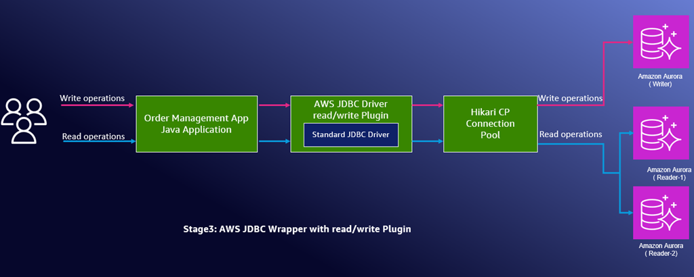

Lets 
## 🚀 AWS Advanced JDBC Driver Demo Application

## 📚 Table of Contents

- [🎯 Purpose](#-purpose)
- [⚡ The Challenge](#-the-challenge)
- [🔧 Solution overview](#-solution-overview)
- [🚀 Getting Started](#-getting-started)
  - [📋 Prerequisites](#-prerequisites)
  - [🎯 Application Overview](#-application-overview)
  - [📁 Repository Structure](#-repository-structure)
- [🛠️ Setup Development Environment](#-setup-development-environment)
- [🚀 Configure the Application with AWS Advanced JDBC Driver](#configure-the-application-with-aws-jdbc-driver)
  - [Stage 1: Standard JDBC (Baseline)](#stage-1-standard-jdbc-baseline)
  - [Stage 2: AWS JDBC with Failover](#stage-2-aws-jdbc-with-failover)
  - [Stage 3: Read/Write Splitting](#stage-3-readwrite-splitting)
- [🧹 Cleanup](#cleanup)
- [📚 Resources](#resources)
- [🔒 Security](#security)
- [👥 Contributors](#contributors)
- [📄 License](#license)

## <a id="-purpose"></a>🎯 Purpose

**The purpose of this repository is to help developers learn how to benefit from the powerful features of [AWS Advanced JDBC Driver](https://github.com/aws/aws-advanced-jdbc-wrapper) in their existing enterprise Java applications.**

We aim to provide step-by-step instructions through our real-world order management system demo, where developers will learn how to:

- **Configure Gradle project** to use AWS Advanced JDBC Driver
- **Implement fast failover** for improved Aurora reliability
- **Enable read/write splitting** for optimal performance
- **Integrate with AWS services** like IAM authentication and Secrets Manager _(Coming in future releases)_
- **Integrate with ADFS and Okta** for federated authentication _(Coming in future releases)_

This repository contains sample code that simulates a real-world order management system powering an online store using Amazon Aurora databases.

## <a id="-the-challenge"></a>⚡ The Challenge

Modern Java applications using Amazon Aurora often struggle to fully take advantage of its cloud-based capabilities. Although Aurora offers powerful features like fast failover, AWS Identity and Access Management (IAM) authentication support, and AWS Secrets Manager integration, standard JDBC drivers weren't designed with cloud-specific features in mind. This isn't a limitation of open-source drivers—they excel at what they were designed for and focus on database standards rather than cloud-native optimizations.

When Aurora fails over in seconds, standard JDBC drivers can take up to a minute to reconnect due to DNS propagation delays. Implementing IAM authentication or Secrets Manager requires complex custom code and error handling that most developers shouldn't need to write.

The AWS Advanced JDBC Driver makes it effortless for developers to unlock the full potential of Aurora with minimal code changes while preserving all the benefits of their existing PostgreSQL driver.

## <a id="-solution-overview"></a>🔧 Solution overview

The AWS Advanced JDBC Driver is an intelligent wrapper that enhances your existing JDBC driver with Aurora and AWS Cloud-based capabilities. It can transform your standard PostgreSQL, MySQL, or MariaDB driver into a cloud-aware, production-ready solution.

**💡 Developers adopt the AWS Advanced JDBC Driver for several compelling capabilities:**

• **Fast failover (beyond DNS limitations)** – The AWS Advanced JDBC Driver maintains a real-time cache of your Aurora cluster topology and each database instance's role (primary or replica) through direct queries to Aurora. This bypasses DNS delays entirely, enabling immediate connections to the new primary instance during failover.

• **Seamless AWS authentication** – Aurora supports IAM database authentication, but implementing it traditionally requires custom code to generate tokens, handle expiration, and manage renewals. The AWS Advanced JDBC Driver minimizes this complexity by automatically handling the entire IAM authentication lifecycle.

• **Built-in Secrets Manager support** – The Secrets Manager integration retrieves database credentials automatically. Your application doesn't need to know the actual password

• **Read/write splitting using connection control** – You can maximize Aurora performance by routing write operations to the primary instance and distributing reads across Aurora replicas.

  **Important:** This feature requires developers to explicitly call `setReadOnly(true)` on connections for read operations - the driver does not automatically parse queries to determine read vs. write operations. Once `setReadOnly(true)` is called, all subsequent statements executed on that connection will be routed to replicas until `setReadOnly(false)` is called. We explore this feature in detail later in this post.

  **⚠️ Spring Boot/Framework Considerations:** If you are using Spring Boot/Framework, please be aware of performance implications when using the read/write splitting feature. The `@Transactional(readOnly = true)` annotation can cause significant performance degradation due to constant switching between reader and writer connections. For detailed information about these considerations and recommended workarounds, please refer to the [AWS Advanced JDBC Wrapper documentation on Spring Boot/Framework limitations](https://github.com/aws/aws-advanced-jdbc-wrapper/blob/main/docs/using-the-jdbc-driver/using-plugins/UsingTheReadWriteSplittingPlugin.md#limitations-when-using-spring-bootframework).

• **Federated authentication** – Enable database access using organizational credentials through Microsoft ADFS or Okta.


**📈 In the following sections, we walk through a real-world transformation using the AWS Advanced JDBC Driver. You'll see how an existing Java application evolves through three progressive stages:**

• **<a id="overview-stage-1"></a>[Stage 1: Standard JDBC (Baseline)](#stage-1-standard-jdbc-baseline)** – The application connects directly to the Aurora writer endpoint through standard JDBC driver, with all operations using a single database instance and relying on DNS-based failover.

• **<a id="overview-stage-2"></a>[Stage 2: AWS JDBC with failover](#stage-2-aws-jdbc-with-failover)** – The application uses AWS Advanced JDBC Driver to maintain awareness of the Aurora cluster topology, enabling fast failover through direct instance discovery while still routing all operations through the writer endpoint.

• **<a id="overview-stage-3"></a>[Stage 3: Read/Write splitting](#stage-3-readwrite-splitting)** – The application uses AWS Advanced JDBC Driver read/write splitting feature to switch between writer/reader instances via calls to the `setReadOnly` method. Upon calling `setReadOnly(true)`, the plugin connects to a reader instance and directs subsequent queries to this instance. **Applications need to explicitly call `setReadOnly(true)` to allow AWS Advanced JDBC Driver to route queries to reader instances.** Once `setReadOnly(true)` is called, all subsequent statements executed on that connection will be routed to replicas until `setReadOnly(false)` is called.



## <a id="-getting-started"></a>🚀 Getting Started

### <a id="-prerequisites"></a>📋 Prerequisites
- AWS account with appropriate permissions
- A Linux-based machine installed with the following software to run the demo application that can connect to the Aurora cluster:
  - [AWS CLI version 2](https://docs.aws.amazon.com/cli/latest/userguide/getting-started-install.html) configured with your credentials
  - Java Development Kit (JDK) 8 or later
  - [Gradle 8.14 or later](https://gradle.org/releases/)

**Choose your infrastructure setup approach:**

**Option A: Infrastructure as Code with [AWS CDK](https://docs.aws.amazon.com/cdk/v2/guide/home.html) (Recommended)**
- **Additional requirements:** [Node.js 20+](https://nodejs.org/en/download/), [Maven 3.6+](https://maven.apache.org/download.cgi)
- **AWS CDK v2 installed and configured**
  - Install: `npm install -g aws-cdk` ([Getting Started Guide](https://docs.aws.amazon.com/cdk/v2/guide/getting-started.html))
  - Bootstrap: `cdk bootstrap` ([Bootstrap Command Reference](https://docs.aws.amazon.com/cdk/v2/guide/ref-cli-cmd-bootstrap.html) if not done previously)
- **IAM permissions:** Your AWS credentials need the permissions specified in [`iam-policy-cdk.json`](iam-policy-cdk.json)

**Option B: Manual Setup**
- **Aurora cluster:** Create Aurora cluster with at least one read replica along the writer
- **Security group:** Port 5432 open from the machine where you cloned the repository

### <a id="-application-overview"></a>🎯 Application Overview

**What You're Working With:**
A Java order management system using HikariCP connection pooling and standard PostgreSQL JDBC driver - a typical setup most developers recognize.

**Business Scenario:**
Our demo application simulates a real-world order management system powering an online store where customers place orders, staff update order statuses, and managers generate sales reports. This scenario demonstrates the challenge of mixed database workloads - some operations need immediate consistency (like processing payments), while others can tolerate slight delays (like generating sales reports).

### <a id="-repository-structure"></a>📁 Repository Structure

```
aws-jdbc-wrapper-demo/
├── src/main/java/com/example/
│   ├── Application.java           # Main application entry point
│   ├── model/
│   │   └── Order.java            # Order entity with customer/product details
│   ├── dao/
│   │   └── OrderDAO.java         # Data access layer (create, update, query operations)
│   └── config/
│       └── DatabaseConfig.java   # HikariCP + JDBC configuration
├── src/main/resources/
│   ├── application.properties    # Database connection settings
│   └── application.properties.example  # Template for database configuration
├── config_templates/             # Configuration templates for each demo step
│   ├── standard-jdbc/           # Current state (standard PostgreSQL JDBC)
│   ├── aws-jdbc-wrapper/        # Step 2: AWS JDBC wrapper migration
│   └── read-write-splitting/    # Step 3: Read/write splitting enabled
├── infrastructure/
│   └── cdk/                     # CDK infrastructure code (Java)
│       ├── src/                 # CDK source code
│       ├── pom.xml             # Maven configuration for CDK
│       └── cdk.json            # CDK configuration
├── build.gradle                 # Gradle dependencies and build configuration
├── demo.sh                     # Switches between demo configurations
├── setup-aurora-cdk.sh         # CDK-based Aurora cluster setup script
├── .env.example                # Environment configuration template
└── iam-policy-cdk.json         # Required IAM permissions for CDK
```

## <a id="-setup-development-environment"></a>🛠️ Setup Development Environment

#### 1. Verify Prerequisites
Make sure all the [prerequisites](#-prerequisites) mentioned above are complete before proceeding.

#### 2. Clone the repository
```bash
git clone https://github.com/aws-samples/sample-aws-advanced-jdbc-wrapper-demo.git
cd sample-aws-advanced-jdbc-wrapper-demo
```

#### 3. Choose your infrastructure setup approach

**Option A: Infrastructure as Code with [AWS CDK](https://docs.aws.amazon.com/cdk/v2/guide/home.html) (Recommended)**

**3.1. Create .env file (optional)**

This step is optional. The CDK script will create an Aurora cluster including VPC, DB subnet group, and security group. If you prefer to create the cluster in an existing VPC, create a .env file as mentioned below and update it with your VPC ID. The script will validate that the VPC exists. If the .env file does not exist, CDK creates a new VPC and creates the cluster in it. The same applies to subnet groups and security groups.

```bash
cp .env.example .env
# Edit .env with your AWS resource values if needed
```

**3.2. Deploy Aurora cluster using setup-aurora-cdk.sh script**

```bash
./setup-aurora-cdk.sh
```

**Option B: Manual Setup**

Create Aurora cluster and read replica using AWS Management Console:
- [Creating an Amazon Aurora DB cluster](https://docs.aws.amazon.com/AmazonRDS/latest/AuroraUserGuide/Aurora.CreateInstance.html)
- [Adding Aurora Replicas to an Aurora DB cluster](https://docs.aws.amazon.com/AmazonRDS/latest/AuroraUserGuide/aurora-replicas-adding.html)

#### 4. Set up application properties

**If you created the cluster using the provided CDK script in step 3.2:**
The setup script automatically created and configured `src/main/resources/application.properties` with your Aurora connection details. You can skip this step.

**For manual setup users (Option B):**
Create and configure the application properties file:

```bash
cp src/main/resources/application.properties.example src/main/resources/application.properties
# Edit application.properties with your Aurora connection details
```

#### 5. Set up database password environment variable

**If you used the CDK script in step 3.2:**
Run these commands to set the database password:

```bash
# Get your current AWS region and the Secret ARN from CDK deployment
AWS_REGION=$(aws configure get region)
SECRET_ARN=$(aws cloudformation describe-stacks --stack-name aws-jdbc-driver-stack --region $AWS_REGION --query "Stacks[0].Outputs[?OutputKey=='SecretArn'].OutputValue" --output text)
export DB_PASSWORD=$(aws secretsmanager get-secret-value --secret-id "$SECRET_ARN" --region $AWS_REGION --query SecretString --output text | jq -r .password)
```

**If you used manual setup (Option B):**
Run this command to set the password you configured when creating your Aurora cluster:

```bash
export DB_PASSWORD=<your_database_password>
```

**Note:** The DB_PASSWORD environment variable is only available in your current terminal session. If you open a new terminal, you'll need to export it again.

## <a id="configure-the-application-with-aws-jdbc-driver"></a>🚀 Configure the Application with AWS Advanced JDBC Driver

This section will cover the three progressive stages of configuring your Java application with the AWS Advanced JDBC Driver:

- **[Stage 1: Standard JDBC (Baseline)](#overview-stage-1)** - Run the application with standard PostgreSQL JDBC driver
- **[Stage 2: AWS JDBC with Failover](#overview-stage-2)** - Configure AWS Advanced JDBC Driver with fast failover capabilities  
- **[Stage 3: Read/Write Splitting](#overview-stage-3)** - Enable intelligent connection routing to distribute reads across Aurora replicas

### Stage 1: Standard JDBC (Baseline)

As described in the [Solution Overview](#🔧-solution-overview), this configures the application with standard JDBC driver.

```bash
# Run the application
./gradlew clean run
```

**Note:** The `./demo.sh standard-jdbc` command resets the application to use standard JDBC driver configuration.

**Expected Output:**

```
Task :run
INFO com.zaxxer.hikari.HikariDataSource - StandardPostgresPool - Starting...
INFO com.example.config.DatabaseConfig - Standard JDBC connection pool initialized

=== PERFORMING WRITE OPERATIONS ===
INFO com.example.dao.OrderDAO - WRITE OPERATION: Creating new order for customer: John Doe
INFO com.example.dao.OrderDAO - Connection URL:
    → WRITER: jdbc:postgresql://aurora-jdbc-demo.cluster-xxxxxxx.us-east-1.rds.amazonaws.com:5432/postgres
INFO com.example.dao.OrderDAO - Order created with ID: 1

=== PERFORMING READ OPERATIONS ===
INFO com.example.dao.OrderDAO - READ OPERATION: Getting order history
INFO com.example.dao.OrderDAO - Connection URL:
    → WRITER: jdbc:postgresql://aurora-jdbc-demo.cluster-xxxxxxx.us-east-1.rds.amazonaws.com:5432/postgres
INFO com.example.dao.OrderDAO - Found 4 orders
INFO com.example.Application - Retrieved 4 total orders

BUILD SUCCESSFUL in 2s
```

**Key Observation:** All operations (reads and writes) use the same Aurora writer endpoint, demonstrating standard JDBC behavior where everything hits the primary database.

### Stage 2: AWS JDBC with Failover

Now let's upgrade this application to use AWS Advanced JDBC Driver while maintaining the same functionality, adding fast failover.

#### Review the changes needed to use AWS Advanced JDBC Driver

We will use a script to automatically apply the necessary changes. The script updates necessary changes to transform your standard JDBC application into a cloud-based application using AWS Advanced JDBC Driver.

Before running the script, let's examine what changes are needed to understand how AWS Advanced JDBC Driver integration works:

**File 1: `build.gradle` - Add AWS Advanced JDBC Driver Dependency**

**Current (Standard JDBC):**

```gradle
dependencies {
    implementation 'com.zaxxer:HikariCP:4.0.3'
    implementation 'org.postgresql:postgresql:42.4.4'
    implementation 'ch.qos.logback:logback-classic:1.2.12'
    implementation 'org.slf4j:slf4j-api:1.7.36'

    compileOnly 'org.projectlombok:lombok:1.18.24'
    annotationProcessor 'org.projectlombok:lombok:1.18.24'
}
```

**Required Change (AWS Advanced JDBC Driver):**

```gradle
dependencies {
    implementation 'com.zaxxer:HikariCP:4.0.3'
    implementation 'org.postgresql:postgresql:42.4.4'
    implementation 'software.amazon.jdbc:aws-advanced-jdbc-wrapper:2.6.2'  // ← Add this
    implementation 'ch.qos.logback:logback-classic:1.2.12'
    implementation 'org.slf4j:slf4j-api:1.7.36'

    compileOnly 'org.projectlombok:lombok:1.18.24'
    annotationProcessor 'org.projectlombok:lombok:1.18.24'
}
```

**Purpose:** Adds the AWS Advanced JDBC Driver library that wraps around the standard PostgreSQL driver.

**File 2: `DatabaseConfig.java` - Update Connection Configuration**

**Current (Standard JDBC Configuration):**

```java
// Standard JDBC configuration
configuredJdbcUrl = props.getProperty("db.url");
config.setJdbcUrl(configuredJdbcUrl);
config.setUsername(props.getProperty("db.username"));

// Get password from environment variable only
String password = System.getenv("DB_PASSWORD");
if (password == null || password.trim().isEmpty()) {
    throw new RuntimeException("DB_PASSWORD environment variable is required but not set");
}
config.setPassword(password);

config.setPoolName("StandardPostgresPool");
log.info("Standard JDBC connection pool initialized");
```

**Required Change (AWS Advanced JDBC Driver Configuration):**

```java
// AWS Advanced JDBC Driver configuration
configuredJdbcUrl = props.getProperty("db.url");
config.setDataSourceClassName("software.amazon.jdbc.ds.AwsWrapperDataSource");
config.addDataSourceProperty("jdbcUrl", configuredJdbcUrl);
config.addDataSourceProperty("targetDataSourceClassName", "org.postgresql.ds.PGSimpleDataSource");

Properties targetProps = new Properties();
targetProps.setProperty("user", props.getProperty("db.username"));

// Get password from environment variable only
String password = System.getenv("DB_PASSWORD");
if (password == null || password.trim().isEmpty()) {
    throw new RuntimeException("DB_PASSWORD environment variable is required but not set");
}
targetProps.setProperty("password", password);
targetProps.setProperty("wrapperPlugins", "failover");  // ← Enables fast failover

config.addDataSourceProperty("targetDataSourceProperties", targetProps);
config.setPoolName("AWSJDBCPool");
log.info("AWS Advanced JDBC Driver connection pool initialized");
```

**Purpose:** Changes from direct JDBC URL configuration to AWS wrapper datasource with plugin support for Aurora-specific features. The wrapper datasource acts as an intelligent proxy that adds Aurora topology awareness, fast failover capabilities, and a foundation for advanced features like read/write splitting and IAM authentication, while transparently delegating actual database operations to the underlying PostgreSQL driver. This transformation enables cloud-native database capabilities without requiring any changes to your application's business logic.

**File 3: `application.properties` - Update JDBC URL**

**Current (Standard JDBC):**

```properties
db.url=jdbc:postgresql://aurora-jdbc-demo.cluster-abc123.us-east-1.rds.amazonaws.com:5432/postgres
```

**Required Change (AWS Advanced JDBC Driver):**

```properties
db.url=jdbc:aws-wrapper:postgresql://aurora-jdbc-demo.cluster-abc123.us-east-1.rds.amazonaws.com:5432/postgres
```

**Purpose:** The `aws-wrapper:` prefix tells the driver to use AWS Advanced JDBC Driver capabilities instead of the standard PostgreSQL driver.

#### Run the script to apply the changes and then execute

```bash
./demo.sh aws-jdbc-wrapper
```

**Expected Output:**

```
Running application...
> Task :run
16:22:18.954 [main] INFO com.zaxxer.hikari.HikariDataSource - AWSJDBCPool - Starting...
16:22:19.632 [main] INFO com.zaxxer.hikari.pool.HikariPool - AWSJDBCPool - Added connection software.amazon.jdbc.wrapper.ConnectionWrapper@770d3326 - org.postgresql.jdbc.PgConnection@4cc8eb05
16:22:19.634 [main] INFO com.zaxxer.hikari.HikariDataSource - AWSJDBCPool - Start completed.
16:22:19.634 [main] INFO com.example.config.DatabaseConfig - AWS Advanced JDBC Driver connection pool initialized

=== WRITE OPERATIONS ===
16:22:19.661 [main] INFO com.example.dao.OrderDAO - WRITE OPERATION: Creating new order for customer: John Doe
16:22:19.665 [main] INFO com.example.dao.OrderDAO - Connection URL:
    → WRITER: jdbc:postgresql://aurora-jdbc-demo4.cluster-xxxxxxx.us-east-1.rds.amazonaws.com:5432/postgres
16:22:19.684 [main] INFO com.example.dao.OrderDAO - Order created with ID: 13

=== READ OPERATIONS ===
16:22:19.706 [main] INFO com.example.dao.OrderDAO - READ OPERATION: Getting order history
16:22:19.708 [main] INFO com.example.dao.OrderDAO - Connection URL:
    → WRITER: jdbc:postgresql://aurora-jdbc-demo4.cluster-xxxxxxx.us-east-1.rds.amazonaws.com:5432/postgres
16:22:19.714 [main] INFO com.example.dao.OrderDAO - Found 16 orders
```

**Key Observation:** All operations still use the writer endpoint, but now your application has fast failover capability without any business logic change

### Stage 3: Read/Write Splitting

Let's unlock the AWS Advanced JDBC Driver feature by enabling intelligent connection routing - writes go to the primary instance while reads distribute across Aurora replicas for optimal performance.

#### Review the changes needed to use Read/Write Splitting

**File 1: `DatabaseConfig.java` – Add readWriteSplitting plugin**

**Current:**

```java
targetProps.setProperty("wrapperPlugins", "failover");
```

**After:**

```java
targetProps.setProperty("wrapperPlugins", "readWriteSplitting,failover");
```

**File 2: `OrderDAO.java` Read Method Enhancement**

```java
conn.setReadOnly(true);  // Enable read/write splitting for this connection
```

#### Run the script to apply the changes and then execute

Run the read/write splitting configuration:

```bash
./demo.sh read-write-splitting
```

**Expected Output:**

```
Running application...
> Task :run
16:51:18.705 [main] INFO com.zaxxer.hikari.HikariDataSource - AWSJDBCReadWritePool - Starting...
16:51:19.405 [main] INFO com.example.config.DatabaseConfig - AWS Advanced JDBC Driver with Read/Write Splitting initialized

=== PERFORMING WRITE OPERATIONS ===
16:51:19.434 [main] INFO com.example.dao.OrderDAO - WRITE OPERATION: Creating new order for customer: John Doe
16:51:19.437 [main] INFO com.example.dao.OrderDAO - Connection URL:
    → WRITER: jdbc:postgresql://aurora-jdbc-demo4.cluster-xxxxxxx.us-east-1.rds.amazonaws.com:5432/postgres
16:51:19.456 [main] INFO com.example.dao.OrderDAO - Order created with ID: 17

=== PERFORMING READ OPERATIONS ===
16:51:19.477 [main] INFO com.example.dao.OrderDAO - READ OPERATION: Getting order history
16:51:20.044 [main] INFO com.example.dao.OrderDAO - Connection URL:
    → READER: jdbc:postgresql://aurora-jdbc-reader-2.curzkcvul3uv.us-east-1.rds.amazonaws.com:5432/postgres
16:51:20.051 [main] INFO com.example.dao.OrderDAO - Found 20 orders

16:51:20.052 [main] INFO com.example.dao.OrderDAO - READ OPERATION: Generating sales report
16:51:20.285 [main] INFO com.example.dao.OrderDAO - Connection URL:
    → READER: jdbc:postgresql://aurora-jdbc-reader-2.curzkcvul3uv.us-east-1.rds.amazonaws.com:5432/postgres
16:51:20.285 [main] INFO com.example.dao.OrderDAO - Sales report generated: {totalOrders=20, totalRevenue=8150.0}

BUILD SUCCESSFUL in 3s
```

**Key Observation:** While the configured URL remains the same, the AWS Advanced JDBC Driver now intelligently routes:

- **Write Operations** → Aurora writer endpoint (primary instance)
- **Read Operations** → Aurora reader endpoints (replica instances)

**Performance Benefits:**

- Reduced writer load: Analytics queries no longer compete with transactions
- Improved scalability: Read traffic distributes across multiple replicas
- Better resource utilization: Each Aurora instance serves its optimal workload

## <a id="cleanup"></a>🧹 Cleanup

To delete all AWS resources created by this demo:

```bash
cd infrastructure/cdk
cdk destroy
```

## <a id="resources"></a>📚 Resources

- [AWS Advanced JDBC Driver Documentation](https://github.com/aws/aws-advanced-jdbc-wrapper)
- [Amazon Aurora Best Practices](https://docs.aws.amazon.com/AmazonRDS/latest/AuroraUserGuide/Aurora.BestPractices.html)
- [HikariCP Connection Pooling](https://github.com/brettwooldridge/HikariCP)

## <a id="security"></a>🔒 Security

See [CONTRIBUTING](CONTRIBUTING.md#security-issue-notifications) for more information.

## <a id="contributors"></a>👥 Contributors

- **Ramesh Eega** - Author of this AWS Advanced JDBC Driver demo application

## <a id="license"></a>📄 License

This library is licensed under the MIT-0 License. See the LICENSE file.