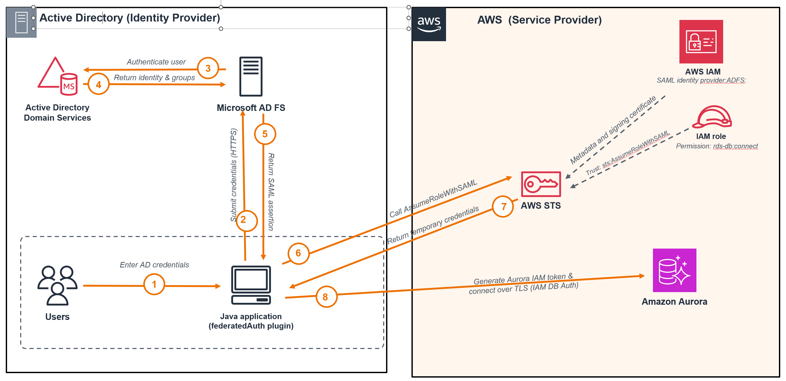

# Stage 5: Federated Authentication with Microsoft Active Directory Federation Services (AD FS)

In this guide, you will implement AD FS federated authentication in a Java application so
users can connect to Aurora with their existing corporate Active Directory credentials,
allowing you to centralize access control in Active Directory. You will use the AWS Advanced
JDBC Wrapper’s
**[Federated Authentication Plugin](https://github.com/aws/aws-advanced-jdbc-wrapper/blob/main/docs/using-the-jdbc-driver/using-plugins/UsingTheFederatedAuthPlugin.md)**
(`federatedAuth`), which signs the user in through AD FS, uses the resulting SAML assertion to
obtain temporary credentials for an IAM role, and then generates an
[IAM database authentication token](https://docs.aws.amazon.com/AmazonRDS/latest/UserGuide/UsingWithRDS.IAMDBAuth.Connecting.html)
to connect to Aurora.

Before you begin, complete
[Stage 4: IAM Database Authentication](../../../README.md#stage-4-iam-database-authentication).
AD FS federated authentication builds on that setup.

## Federation configuration overview

The first step is to establish a SAML trust relationship between AD FS and AWS. In this
relationship, AD FS is the identity provider and AWS is the service provider. Then update the
Java application to authenticate through AD FS using the AWS Advanced JDBC Wrapper’s
Federated Authentication Plugin.

At a high level, these are the configurations needed:

- **AD FS**
  - Add AWS as a relying party to establish the trust that identifies AWS as the SAML service
    provider (SP).
  - Map Active Directory users and groups to the SAML attributes AWS requires.
  - Export the federation metadata that AWS uses to recognize and trust AD FS.

- **AWS**
  - Import the AD FS federation metadata as an
    [IAM SAML identity provider](https://docs.aws.amazon.com/IAM/latest/UserGuide/id_roles_providers_create_saml.html).
    This tells AWS about AD FS as an external identity provider (IdP).
  - Create an IAM role that trusts the IAM SAML identity provider through
    `sts:AssumeRoleWithSAML` and allows `rds-db:connect` to the Aurora IAM database user.

- **Java application**
  - Configure the AWS Advanced JDBC Wrapper’s Federated Authentication Plugin with the AD FS
    endpoint and user credentials, IAM SAML provider ARN, and IAM role ARN.
  - The plugin authenticates through AD FS, assumes the IAM role, generates an IAM database
    authentication token, and connects to Aurora.

Later sections examine each area in detail through a hands-on walkthrough. You will build an
AD FS test environment, configure the trust relationship in AD FS and AWS, update the Java
application, and validate the complete authentication flow to Aurora end to end.

## How federated authentication works

After the trust relationship described above is established, the following diagram illustrates
how the Java application uses AD FS and IAM federation to connect to Aurora. Each numbered step
is explained below.



1. The user provides their Active Directory credentials to the Java application.
2. The Java application uses the AWS Advanced JDBC Wrapper’s `federatedAuth` plugin to
   submit the credentials to the AD FS sign-in page over HTTPS.
3. AD FS asks Active Directory Domain Services to validate the user’s credentials and retrieve
   identity attributes, including security-group membership.
4. Active Directory Domain Services validates the credentials and returns the user’s identity
   attributes, including security-group membership, to AD FS.
5. AD FS constructs a signed SAML assertion describing the authenticated user, including the
   IAM role ARN and IAM SAML provider ARN mapped from the user’s group membership, and returns
   it to the JDBC Wrapper’s `federatedAuth` plugin.
6. The JDBC Wrapper calls
   [AWS Security Token Service (AWS STS)](https://docs.aws.amazon.com/STS/latest/APIReference/Welcome.html)
   using the
   [`AssumeRoleWithSAML`](https://docs.aws.amazon.com/STS/latest/APIReference/API_AssumeRoleWithSAML.html)
   API operation, passing the SAML assertion, the configured SAML identity provider ARN, and
   the IAM role ARN to assume. AWS STS validates the assertion using the provider’s metadata
   and signing certificate, and confirms the IAM role’s trust policy allows this SAML provider
   to assume the role.
7. AWS STS returns temporary credentials for the selected IAM role.
8. The JDBC Wrapper uses the temporary credentials to generate an Aurora IAM authentication
   token locally, then connects over TLS as the configured IAM database user.

## Deploy the AD FS authentication flow in your environment

In this section, you will establish federation trust between AD FS and AWS, define AD FS claim
rules that map Active Directory users and groups to IAM roles, update your Java application to
use federated authentication, and test the complete flow end to end.

The process is organized into three steps:

1. **[Set up AD FS and AWS IAM federation](#1-set-up-ad-fs-and-aws-iam-federation)**
2. **[Update the Java application to use AD FS authentication](#2-update-the-java-application-to-use-ad-fs-authentication)**
3. **[Run and test the authentication flow](#3-run-and-test-the-authentication-flow)**

## 1. Set up AD FS and AWS IAM federation

### How the federation configuration fits together

This section explains the configuration summarized above and how each part connects.

In AD FS, you configure AWS as the SAML service provider (SP). This is called adding relying party
trust between AD FS and AWS. In the relying party trust, you specify the AWS service-provider
identifier (`urn:amazon:webservices`), the
[AWS SAML endpoint](https://docs.aws.amazon.com/general/latest/gr/signin-service.html), and the
claim rules.

A claim describes the authenticated user, such as their identity or group membership. AD FS
claim rules read and transform this information into the SAML elements and attributes included
in the signed SAML assertion.

AWS uses the
[SAML assertion](https://docs.aws.amazon.com/IAM/latest/UserGuide/id_roles_providers_create_saml_assertions.html)
to identify the user, determine which IAM role can be assumed, and name the resulting role
session. The key elements and attributes are:

| SAML element or attribute | Purpose | Example |
|---|---|---|
| `NameID` | Identifies the authenticated user in the SAML subject. | `CORP\bob` |
| `RoleSessionName` | Names the temporary AWS role session. This guide uses the user’s email address. | `bob@corp.example.com` |
| `Role` | Identifies the IAM role and IAM SAML provider associated with the user. | `arn:aws:iam::<AWS_ACCOUNT_ID>:role/ADFS-JDBCDemo,arn:aws:iam::<AWS_ACCOUNT_ID>:saml-provider/ADFS` |

The `Role` value contains an IAM SAML provider ARN and IAM role ARN as a pair. The role ARN
identifies the role the user can assume, and the provider ARN refers to the IAM SAML provider
you create in AWS, described next.

For AWS to verify these signed assertions, it must first trust AD FS. After configuring the
relying party trust and claim rules, export the AD FS federation metadata. In AWS, import this
metadata as an
[IAM SAML provider](https://docs.aws.amazon.com/IAM/latest/UserGuide/id_roles_providers_create_saml.html).
The provider represents AD FS in IAM, and the metadata includes the public token-signing
certificate that AWS uses to verify assertions signed by AD FS. Then create an IAM role whose
trust policy names this provider and allows `sts:AssumeRoleWithSAML`. Attach a permissions
policy to the role that grants `rds-db:connect`. The `rds-db:connect` permission authorizes the
assumed IAM role to connect to the specified Aurora cluster as the configured IAM database
user. The provider ARN and role ARN must match the pair included by AD FS in the SAML
assertion.

Together, these configurations allow AWS to trust the identity asserted by AD FS, map the user
to the intended IAM role, and authorize that role to connect to Aurora as the configured IAM
database user.

This step provides two infrastructure paths:

- **Path A: Build a test environment end to end** — Use the provided AWS CDK and setup
  scripts to create a test environment.
- **Path B: Integrate with your existing infrastructure** — Use your organization’s existing
  Active Directory, AD FS, SAML identity provider, and IAM roles.

> We recommend completing Path A first. It provides a controlled environment for learning
> and validating the complete federation workflow before adapting it to your organization’s
> infrastructure.

### Path A: Build a test environment end to end

Use this path to build the complete test environment with the provided AWS CDK and setup
scripts.

#### Create and configure Active Directory and AD FS

In this section, you will:

- Deploy a Windows Server 2025 test domain controller running Active Directory Domain
  Services and AD FS.
- Create the `bob@corp.example.com` test user, the `adfssvc` service account, and the
  `AWS-JDBCDemo` Active Directory group, then add `bob` to the group.
- Configure forms authentication and register AWS as an AD FS relying party.
- Add the required SAML claim rules, including the `Role` claim rule that maps the
  `AWS-JDBCDemo` Active Directory group to the expected `ADFS-JDBCDemo` IAM role. The IAM
  role is created in the next section.
- Export `FederationMetadata.xml` for creating the SAML identity provider in IAM.

Before you begin, you will need:

- The AWS account ID that owns the Aurora cluster and where the IAM SAML provider and IAM
  role will be created.
- The name to use for the SAML identity provider in IAM. The test environment defaults to
  `ADFS`.
- An existing [EC2 key pair](https://docs.aws.amazon.com/AWSEC2/latest/UserGuide/create-key-pairs.html)
  in the AWS Region where the domain controller will be deployed. Keep its private key
  available because it is used to retrieve the Windows Administrator password.

1. Go to the AD FS infrastructure directory and create its local configuration file:

   ```bash
   cd infrastructure/identity_providers/adfs
   cp .env.example .env
   ```

2. Update `.env`:

   - Set `ADFS_KEY_NAME` to the name of your EC2 key pair.
   - Keep the default `ADFS_SAML_PROVIDER_NAME=ADFS` unless you need a different name. This
     value is used for the SAML identity provider created in IAM.
   - Choose where to deploy the domain controller:
     - Keep `AURORA_STACK_NAME` set to the deployed Aurora stack if you used the provided CDK
       to create the Aurora cluster. The script discovers the VPC and DB subnets where the
       cluster was deployed, then deploys the domain controller into the first subnet in the
       cluster's DB subnet group.
     - Or set both `ADFS_VPC_ID` and `ADFS_SUBNET_ID` to deploy the domain controller into a
       specific existing VPC and subnet.

   Keep the remaining defaults for the test environment. The Directory Services Restore Mode
   password is generated and stored in AWS Secrets Manager.

3. Deploy the domain controller:

   ```bash
   ./scripts/setup-adfs-cdk.sh
   ```

   The script discovers the deployed Aurora cluster’s VPC and subnets, lists the available
   subnets, and deploys the Windows Server 2025 domain controller into the selected subnet.

4. Connect to the domain controller and configure AD FS. Use the
   `DomainControllerInstanceId` value printed by the previous step to identify the instance
   in the Amazon EC2 console.

   > You can connect through
   > [browser-based Fleet Manager Remote Desktop](https://docs.aws.amazon.com/AWSEC2/latest/UserGuide/connect-rdp-fleet-manager.html).
   > Sign in using either the EC2 key pair configured as `ADFS_KEY_NAME` or the Windows
   > `Administrator` username and password. If needed, follow the AWS instructions to
   > [retrieve the initial Windows Administrator password](https://docs.aws.amazon.com/AWSEC2/latest/UserGuide/connect-rdp.html#retrieve-windows-admin-password).

   After the Windows desktop opens, copy `scripts/setup-adfs.ps1` to the server. The script will:

   - Creates the demo users and Active Directory group.
   - Configures forms authentication.
   - Registers AWS as an AD FS relying party.
   - Adds claim rules that map `AWS-<suffix>` Active Directory groups to
     `ADFS-<suffix>` IAM roles.
   - Exports the federation metadata required by the IAM federation setup below.

   Before running the script:

   - Use the same SAML provider name configured as `ADFS_SAML_PROVIDER_NAME` in `.env`.
     This name connects the AD FS role claim to the SAML identity provider created in IAM.
   - The script prompts for passwords when it creates the demo user (`bob`) and AD FS
     service account (`adfssvc`). Use passwords that satisfy the Active Directory complexity
     policy.
   - If Windows requests a restart, restart the server and run the same command again. The
     script is idempotent and skips completed steps.
   - Save the output locally. The IAM federation setup below uses the metadata path, SAML
     provider name, and IAM role name shown in the output. Do not commit this output.

   Run the script from an elevated PowerShell session:

   ```powershell
   .\setup-adfs.ps1 -AwsAccountId "<AWS_ACCOUNT_ID>" -SamlProviderName "<same value as ADFS_SAML_PROVIDER_NAME in .env>"
   ```

5. Copy the generated `FederationMetadata.xml` file from the domain controller's desktop to
   the machine where you cloned this repository. You can save it in any directory, but keep
   the filename `FederationMetadata.xml`. You will provide its absolute path in the **Create
   the SAML identity provider and IAM role** section below.

6. The AD FS hostname resolves only through the domain controller's DNS, so the Java
   application host needs a way to resolve it. For the test environment, add a hosts-file
   entry that maps the domain controller's private IP (the `DomainControllerPrivateIp`
   deployment output) to the AD FS hostname. On the Linux host running the Java application:

   ```bash
   echo "<DC_PRIVATE_IP> adfs.corp.example.com" | sudo tee -a /etc/hosts
   ```

   Then confirm the host can resolve and reach the AD FS HTTPS endpoint:

   ```bash
   ADFS_HOST=adfs.corp.example.com
   getent hosts "$ADFS_HOST"
   curl --connect-timeout 5 --head -k "https://$ADFS_HOST/adfs/ls/"
   ```

   `getent` should return the AD FS IP address, and `curl` should reach the HTTPS endpoint.
   AD FS uses a self-signed certificate in this test environment, so `curl` reports that it
   could not verify the certificate's legitimacy. That warning is expected.

7. Record the following values. You will use them to configure `application.properties` in
   Section 2. These values assume that you kept the default domain and demo user
   configuration:

   ```properties
   idp.endpoint=adfs.corp.example.com
   idp.username=bob@corp.example.com
   ```

#### Create the SAML identity provider and IAM role

In this section, you will:

- Create a [SAML identity provider in IAM](https://docs.aws.amazon.com/IAM/latest/UserGuide/id_roles_providers_saml.html#CreatingSAML-configuring-IdP)
  from `FederationMetadata.xml`.
- Create the `ADFS-JDBCDemo` IAM role with a trust policy that allows the SAML identity
  provider to use `sts:AssumeRoleWithSAML`. This completes the default
  `AWS-JDBCDemo` Active Directory group to `ADFS-JDBCDemo` IAM role mapping.
- Attach a permissions policy to the IAM role that allows `rds-db:connect` on the Aurora
  database user resource ARN.

1. Review and update the IAM federation settings in `.env`. Only the federation metadata
   path normally needs to be changed. We recommend keeping the remaining defaults for the
   test environment unless you changed the corresponding values in the previous steps.

   ```properties
   ADFS_FEDERATION_METADATA_PATH=/absolute/path/to/FederationMetadata.xml
   ADFS_SAML_PROVIDER_NAME=ADFS
   ```

   > **Note:** Make sure `ADFS_FEDERATION_METADATA_PATH` is uncommented after you update
   > the path.

   To scope the role's `rds-db:connect` permission, the deployment requires the Aurora
   cluster resource ID. `AURORA_STACK_NAME` must identify the deployed Aurora stack so the
   setup script can discover the resource ID, or `AURORA_CLUSTER_RESOURCE_ID` must be set
   directly.

2. Deploy the SAML identity provider and federated IAM role:

   ```bash
   ./scripts/setup-adfs-iam-cdk.sh
   ```

3. Record the `SamlProviderArn` and `FederatedRoleArn` stack outputs. You need them as
   `iam.idp.arn` and `iam.role.arn` in Section 2.

### Path B: Integrate with your existing infrastructure

Use this path when your organization already provides Active Directory and AD FS. Work with
your identity and AWS administrators to complete the following configuration.

#### Configure Active Directory and AD FS

> Before modifying an existing AD FS environment, review
> [`setup-adfs.ps1`](scripts/setup-adfs.ps1). Path A uses this script to configure the test
> environment and demonstrates the Active Directory and AD FS changes required for this
> integration. Do not run it unchanged in an existing organizational environment
> without review by your identity administrator.

1. Obtain the following information from your AWS administrator:

   - AWS account ID
   - Planned SAML identity provider name in IAM

   The SAML identity provider does not need to exist yet, but its name must be decided before
   configuring the AD FS claim rules. Each `Role` claim includes the complete SAML provider
   ARN. Use the same provider name when creating the SAML identity provider in IAM later in
   this path.

2. Plan the Active Directory-to-IAM role mapping.

   Decide which Active Directory groups or user attributes map to each IAM role. You will
   implement this mapping later when configuring the AD FS `Role` claim.

   The mapping can identify roles explicitly:

   ```text
   Active Directory group → IAM role
   DatabaseDevelopers      → AuroraDeveloperRole
   DatabaseReaders         → AuroraReadOnlyRole
   ```

   Or use a naming convention:

   ```text
   Active Directory group → IAM role
   AWS-<suffix>            → ADFS-<suffix>
   ```

3. Enable forms-based authentication in AD FS.

   **Reference:** [Enable intranet forms-based authentication for clients that do not support WIA](https://learn.microsoft.com/en-us/windows-server/identity/ad-fs/operations/configure-intranet-forms-based-authentication-for-devices-that-do-not-support-wia).

   **Repository test environment:** Step 9 in
   [`setup-adfs.ps1`](scripts/setup-adfs.ps1) enables forms authentication.
4. Configure AWS as a relying party in AD FS and add the SAML claims required by AWS. Use
   the AWS account and planned SAML identity provider information from Step 1 and the role
   mapping from Step 2.

   See [Configure your SAML 2.0 IdP with relying-party trust and claims](https://docs.aws.amazon.com/IAM/latest/UserGuide/id_roles_providers_create_saml_relying-party.html).
   You can also use Step 11 in [`setup-adfs.ps1`](scripts/setup-adfs.ps1) as a reference for
   how Path A configures the relying-party trust and claim rules.

   - Register AWS as the relying party:
     - Relying-party identifier: `urn:amazon:webservices`
     - Assertion consumer endpoint: `https://signin.aws.amazon.com/saml`
   - Configure the relying-party access policy for the intended users.
   - Configure the SAML claims required by AWS:
     - `NameID` identifies the authenticated user.
     - `RoleSessionName` identifies the temporary AWS role session.
     - `Role` contains the IAM role ARN and SAML identity provider ARN.
   - Configure AD FS to retrieve the selected Active Directory groups or attributes and map
     them to the corresponding IAM roles in the `Role` claim.

5. Export or download the AD FS federation metadata as `FederationMetadata.xml`. It is
   normally available at:

   ```text
   https://<AD_FS_HOST>/FederationMetadata/2007-06/FederationMetadata.xml
   ```

   The file contains the AD FS issuer, sign-in endpoints, and public token-signing
   certificate. The IAM federation setup below uses it to create the SAML identity provider
   in IAM, allowing AWS STS to validate assertions issued by AD FS.

   **References:**

   - [AD FS endpoints](https://learn.microsoft.com/en-us/windows-server/identity/ad-fs/troubleshooting/ad-fs-tshoot-endpoints)
   - **Repository test environment:** Step 12 in
     [`setup-adfs.ps1`](scripts/setup-adfs.ps1) exports `FederationMetadata.xml`.
6. Confirm that the Java application environment can resolve and reach the AD FS HTTPS
   endpoint. For example, run from the Linux environment hosting the Java application:

   ```bash
   ADFS_HOST=adfs.corp.example.com
   getent hosts "$ADFS_HOST"
   curl --connect-timeout 5 --head "https://$ADFS_HOST/adfs/ls/"
   ```

   `getent` should return the AD FS IP address, and `curl` should reach the HTTPS endpoint.
   If AD FS uses a self-signed certificate, note it for the Java application configuration
   in Section 2.
7. Gather the following AD FS values for the Java application configuration in Section 2:

   ```properties
   # AD FS hostname, for example: adfs.corp.example.com
   idp.endpoint=<AD_FS_HOSTNAME>

   # Active Directory user, for example: bob@corp.example.com
   idp.username=<AD_USER>@<DOMAIN>
   ```

   Use the AD FS hostname without `https://`. Supply the Active Directory password through
   `IDP_PASSWORD` as shown in Section 3.1; do not store it in `application.properties`.

#### Configure the SAML identity provider and IAM role

Complete this section after obtaining `FederationMetadata.xml` from AD FS.

1. Create or update a
   [SAML identity provider in IAM](https://docs.aws.amazon.com/IAM/latest/UserGuide/id_roles_providers_create_saml.html)
   using the `FederationMetadata.xml` file exported during the AD FS configuration above.

2. Create an
   [IAM role for SAML 2.0 federation](https://docs.aws.amazon.com/IAM/latest/UserGuide/id_roles_create_for-idp_saml.html).
   Configure its trust policy to:

   - Name the SAML identity provider as the federated principal.
   - Allow `sts:AssumeRoleWithSAML`.
   - Require the expected SAML audience, such as `https://signin.aws.amazon.com/saml`.

3. Following [Create and use an IAM policy for IAM database authentication](https://docs.aws.amazon.com/AmazonRDS/latest/AuroraUserGuide/UsingWithRDS.IAMDBAuth.IAMPolicy.html),
   attach a permissions policy to the IAM role that allows `rds-db:connect` on the Aurora
   database user resource ARN:

   ```text
   arn:aws:rds-db:<AWS_REGION>:<AWS_ACCOUNT_ID>:dbuser:<CLUSTER_RESOURCE_ID>/<DB_IAM_USERNAME>
   ```

4. If AD FS maps users to multiple IAM roles, repeat Steps 2 and 3 for every role included
   in the AD FS `Role` claim.

5. Confirm that the SAML identity provider and IAM role ARNs match the values emitted by
   AD FS:

   - Copy the SAML identity provider ARN and IAM role ARN from IAM.
   - Follow [View a SAML response in your browser](https://docs.aws.amazon.com/IAM/latest/UserGuide/troubleshoot_saml_view-saml-response.html)
     to capture and decode an AD FS authentication response.
   - Find the `https://aws.amazon.com/SAML/Attributes/Role` attribute.
   - Confirm that an `AttributeValue` contains the exact SAML identity provider and IAM role
     ARNs. ARN values are case-sensitive.
   - If the assertion contains multiple roles, confirm that the role selected for the Java
     application appears in the assertion.

   The relevant assertion content should resemble the AWS
   [`Role` SAML attribute](https://docs.aws.amazon.com/IAM/latest/UserGuide/id_roles_providers_create_saml_assertions.html)
   format:

   ```xml
   <Attribute Name="https://aws.amazon.com/SAML/Attributes/Role">
     <AttributeValue>arn:aws:iam::<AWS_ACCOUNT_ID>:role/<IAM_ROLE_NAME>,arn:aws:iam::<AWS_ACCOUNT_ID>:saml-provider/<SAML_PROVIDER_NAME></AttributeValue>
   </Attribute>
   ```

6. Record the SAML identity provider ARN, selected IAM role ARN, AWS Region, and IAM database
   username. You will use these values when configuring the Java application.

## 2. Update the Java application to use AD FS authentication

Start with the working Stage 4 configuration in
`src/main/resources/application.properties`. Keep `db.url` and `db.iam.username`, then add
the AD FS and IAM federation values gathered in Section 1.

### Configure the application properties

The following application properties map to the plugin parameters used by this guide:

| Application property | Plugin parameter | Description | Path A example |
|---|---|---|---|
| `db.iam.username` | `dbUser` | Aurora database user configured for IAM database authentication in Stage 4. | `db_iam_user` |
| `idp.endpoint` | `idpEndpoint` | AD FS hostname without `https://`. | `adfs.corp.example.com` |
| `idp.username` | `idpUsername` | Active Directory user that AD FS authenticates. | `bob@corp.example.com` |
| `sslInsecure` | `sslInsecure` | Skips AD FS server-certificate validation when `true`; use only for self-signed test certificates. | `true` |
| `iam.role.arn` | `iamRoleArn` | IAM role selected from the SAML assertion. | `arn:aws:iam::<AWS_ACCOUNT_ID>:role/ADFS-JDBCDemo` |
| `iam.idp.arn` | `iamIdpArn` | SAML identity provider ARN in IAM. | `arn:aws:iam::<AWS_ACCOUNT_ID>:saml-provider/ADFS` |
| `iam.region` | `iamRegion` | AWS Region used to call STS and generate the IAM database token. | `us-east-1` |

The required `idpPassword` plugin parameter is supplied through the `IDP_PASSWORD` environment
variable in Section 3.1, not through `application.properties`.

For descriptions of every required and optional parameter, see
[Using the Federated Authentication Plugin](https://github.com/aws/aws-advanced-jdbc-wrapper/blob/main/docs/using-the-jdbc-driver/using-plugins/UsingTheFederatedAuthPlugin.md#federated-authentication-plugin-parameters).

Update `application.properties` with the values recorded in Section 1:

```properties
# Existing Stage 4 configuration
db.url=<AURORA_JDBC_URL>
db.iam.username=db_iam_user

# AD FS authentication
idp.endpoint=adfs.corp.example.com
idp.username=bob@corp.example.com
# Path A only: true skips certificate validation for its self-signed test certificate.
# Use false when the Java host trusts the AD FS certificate.
sslInsecure=true

# AWS federation
iam.role.arn=arn:aws:iam::<AWS_ACCOUNT_ID>:role/ADFS-JDBCDemo
iam.idp.arn=arn:aws:iam::<AWS_ACCOUNT_ID>:saml-provider/ADFS
iam.region=us-east-1
```

### Review the changes needed to use AD FS authentication

**File 1: `DatabaseConfig.java` – Replace the IAM Authentication Plugin with the Federated Authentication Plugin**

**Current:**

```java
Properties targetProps = new Properties();
targetProps.setProperty("user", iamUsername);
targetProps.setProperty("sslmode", "require");
targetProps.setProperty(
    "wrapperPlugins",
    "readWriteSplitting,failover,iam");
```

**After:**

```java
Properties targetProps = new Properties();
targetProps.setProperty("sslmode", "require");
targetProps.setProperty(
    "wrapperPlugins",
    "readWriteSplitting,failover,federatedAuth");

// Identity provider (AD FS)
targetProps.setProperty("idpName", "adfs");
targetProps.setProperty("idpEndpoint", props.getProperty("idp.endpoint"));
targetProps.setProperty("idpPort", "443");
targetProps.setProperty("idpUsername", props.getProperty("idp.username"));

String idpPassword = System.getenv("IDP_PASSWORD");
if (idpPassword == null || idpPassword.trim().isEmpty()) {
    throw new RuntimeException("IDP_PASSWORD environment variable is required but not set");
}
targetProps.setProperty("idpPassword", idpPassword);

targetProps.setProperty("rpIdentifier", "urn:amazon:webservices");
targetProps.setProperty("sslInsecure", props.getProperty("sslInsecure", "false"));

// AWS federation
targetProps.setProperty("iamRoleArn", props.getProperty("iam.role.arn"));
targetProps.setProperty("iamIdpArn", props.getProperty("iam.idp.arn"));
targetProps.setProperty("iamRegion", props.getProperty("iam.region"));
targetProps.setProperty("dbUser", iamUsername);
```

The `federatedAuth` plugin authenticates the Active Directory user through AD FS, retrieves
the SAML assertion, and calls AWS STS to assume the configured IAM role. It then uses the
temporary role credentials to generate an IAM authentication token for `dbUser`. The database
user remains the `db.iam.username` configured in Stage 4, and no database password is set.

The Path A test environment uses a self-signed AD FS certificate, so its
`application.properties` example sets `sslInsecure=true`. For an organizational environment,
configure the Java host to trust the AD FS certificate and set `sslInsecure=false`, or omit the
property to use its secure default, instead of disabling certificate validation.

**File 2: `build.gradle` – Add the AWS SDK STS and Apache HTTP Client dependencies**

**Current:**

```gradle
implementation 'software.amazon.jdbc:aws-advanced-jdbc-wrapper:4.4.0'
implementation 'software.amazon.awssdk:rds:2.46.10'
```

**After:**

```gradle
implementation 'software.amazon.jdbc:aws-advanced-jdbc-wrapper:4.4.0'
implementation 'software.amazon.awssdk:rds:2.46.10'
implementation 'software.amazon.awssdk:sts:2.46.10'           // Add this
implementation 'org.apache.httpcomponents:httpclient:4.5.14'  // Add this
```

The AWS SDK STS dependency supports `AssumeRoleWithSAML`, and Apache HTTP Client supports the
AD FS forms-authentication exchange. No changes are required in `OrderDAO.java` or the
application business logic.

## 3. Run and test the authentication flow

### 3.1 Set the Active Directory password

The application reads the Active Directory password from the `IDP_PASSWORD` environment
variable. Set it before running the application:

```bash
export IDP_PASSWORD="<AD_PASSWORD>"
```

Stage 5 does not use the database password. Unset it so the run confirms that authentication
uses AD FS and an IAM database token:

```bash
unset DB_PASSWORD
```

Both environment-variable changes apply only to the current terminal session.

### 3.2 Run the Java application

Move to the root of your cloned repository, then run the demo:

```bash
cd "$(git rev-parse --show-toplevel)"
./demo.sh adfs-auth
```

The script installs the Stage 5 `build.gradle`, `DatabaseConfig.java`, and read/write
splitting DAO templates, ensures the AWS JDBC Wrapper URL prefix is present, and runs the
application.

**Expected output:**

```text
=== Enable Federated Database Authentication ===
Authenticating through AD FS and AWS IAM with SAML...
Configuration updated:
   - Federated Authentication plugin enabled
   - AD FS SAML authentication and AWS STS role assumption enabled
   - Database password is not used
   - Read/Write Splitting and failover remain enabled

Running application...
> Task :run
INFO  com.zaxxer.hikari.HikariDataSource - AWSJDBCFederatedAuthPool - Starting...
INFO  com.zaxxer.hikari.HikariDataSource - AWSJDBCFederatedAuthPool - Start completed.
INFO  com.example.config.DatabaseConfig - AWS JDBC Wrapper with Federated Authentication initialized
INFO  com.example.dao.OrderDAO - Connection URL:
    → WRITER: jdbc:postgresql://<AURORA_WRITER_INSTANCE>:5432/postgres?...
INFO  com.example.dao.OrderDAO - Table 'orders' created or already exists

=== PERFORMING WRITE OPERATIONS ===
INFO  com.example.dao.OrderDAO - WRITE OPERATION: Creating new order for customer: John Doe
INFO  com.example.dao.OrderDAO - Connection URL:
    → WRITER: jdbc:postgresql://<AURORA_WRITER_INSTANCE>:5432/postgres?...
INFO  com.example.dao.OrderDAO - Order created with ID: <ORDER_ID>
...

=== PERFORMING READ OPERATIONS ===
INFO  com.example.dao.OrderDAO - READ OPERATION: Getting order history
INFO  com.example.dao.OrderDAO - Connection URL:
    → READER: jdbc:postgresql://<AURORA_READER_INSTANCE>:5432/postgres?...
INFO  com.example.dao.OrderDAO - Found <ORDER_COUNT> orders
INFO  com.example.Application - Retrieved <ORDER_COUNT> total orders

INFO  com.example.dao.OrderDAO - READ OPERATION: Generating sales report
INFO  com.example.dao.OrderDAO - Connection URL:
    → READER: jdbc:postgresql://<AURORA_READER_INSTANCE>:5432/postgres?...
INFO  com.example.dao.OrderDAO - Sales report generated: {totalOrders=<ORDER_COUNT>, totalRevenue=<TOTAL_REVENUE>, avgOrderValue=<AVERAGE_ORDER_VALUE>}

INFO  com.example.dao.OrderDAO - READ OPERATION: Searching orders for customer: John
INFO  com.example.dao.OrderDAO - Connection URL:
    → READER: jdbc:postgresql://<AURORA_READER_INSTANCE>:5432/postgres?...
INFO  com.example.dao.OrderDAO - Found <MATCH_COUNT> orders for customer: John

INFO  com.zaxxer.hikari.HikariDataSource - AWSJDBCFederatedAuthPool - Shutdown initiated...
INFO  com.zaxxer.hikari.HikariDataSource - AWSJDBCFederatedAuthPool - Shutdown completed.
INFO  com.example.config.DatabaseConfig - Database connection pool closed

BUILD SUCCESSFUL
Demo step 'adfs-auth' completed!

Next steps:
  Demo complete! Check the logs to verify federated authentication and read/write routing.
  To reset: ./demo.sh standard-jdbc
```

Order IDs, counts, totals, timestamps, instance endpoints, and query parameters vary between
runs.

### Conclusion

**Key observation:** The application connects to Aurora without a database password after
AD FS authenticates the Active Directory user and AWS STS returns temporary credentials for
the selected IAM role.

The output confirms that:

- `AWSJDBCFederatedAuthPool` starts successfully using the Federated Authentication Plugin.
- Write operations connect to an Aurora writer instance.
- Read-only operations connect to an Aurora reader instance.
- Read/write splitting and failover remain enabled.

## Cleanup

Use this cleanup only if you completed **Path A: Build a test environment end to end**.
Deleting these stacks permanently removes the test IAM federation resources, domain
controller, and AD FS environment.

Use the same AWS CLI profile and Region used for deployment. If you used a named profile,
export it before running the cleanup commands:

```bash
export AWS_PROFILE="<PROFILE_NAME>" # Omit this line if you used the default profile
export AWS_REGION="<AWS_REGION>"

aws sts get-caller-identity --query '{Account:Account,Arn:Arn}'
```

Review the account and ARN before continuing.

### Delete the SAML identity provider and IAM role

Delete the CloudFormation stack rather than deleting the IAM resources directly. This
removes the SAML identity provider, federated IAM role, and its permissions policy without
causing CloudFormation drift. New federated-authentication requests will stop working.

```bash
aws cloudformation describe-stacks \
  --stack-name adfs-iam-identity-provider \
  --region "$AWS_REGION" \
  --query 'Stacks[0].StackStatus'

aws cloudformation delete-stack \
  --stack-name adfs-iam-identity-provider \
  --region "$AWS_REGION"

aws cloudformation wait stack-delete-complete \
  --stack-name adfs-iam-identity-provider \
  --region "$AWS_REGION"
```

### Delete the test Active Directory and AD FS environment

Delete the domain-controller stack after the IAM federation stack has been removed. This
permanently removes the test domain controller and supporting resources owned by the stack.

```bash
aws cloudformation describe-stacks \
  --stack-name adfs-domain-controller \
  --region "$AWS_REGION" \
  --query 'Stacks[0].StackStatus'

aws cloudformation delete-stack \
  --stack-name adfs-domain-controller \
  --region "$AWS_REGION"

aws cloudformation wait stack-delete-complete \
  --stack-name adfs-domain-controller \
  --region "$AWS_REGION"
```

These steps do not delete the Aurora resources. To remove those resources, follow the
[cleanup instructions in the main README](../../../README.md#cleanup).
